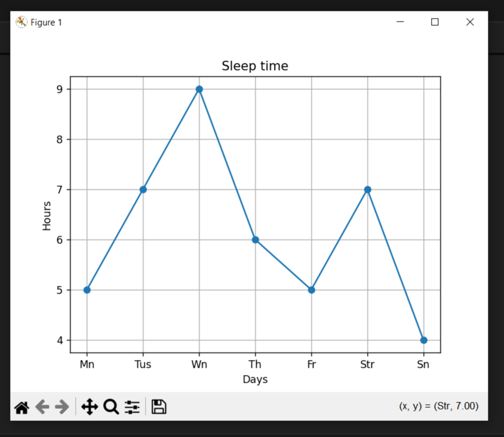
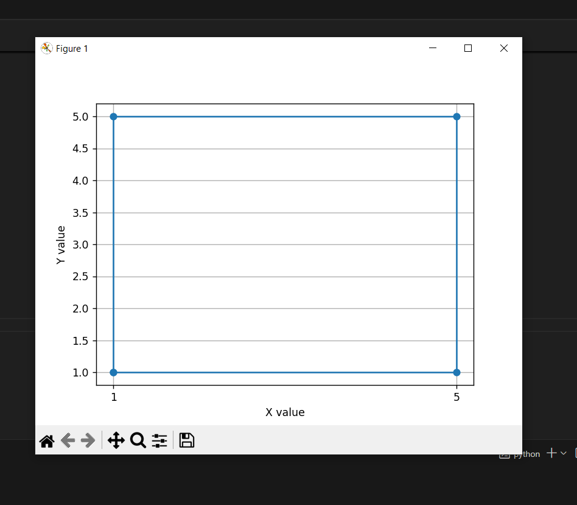
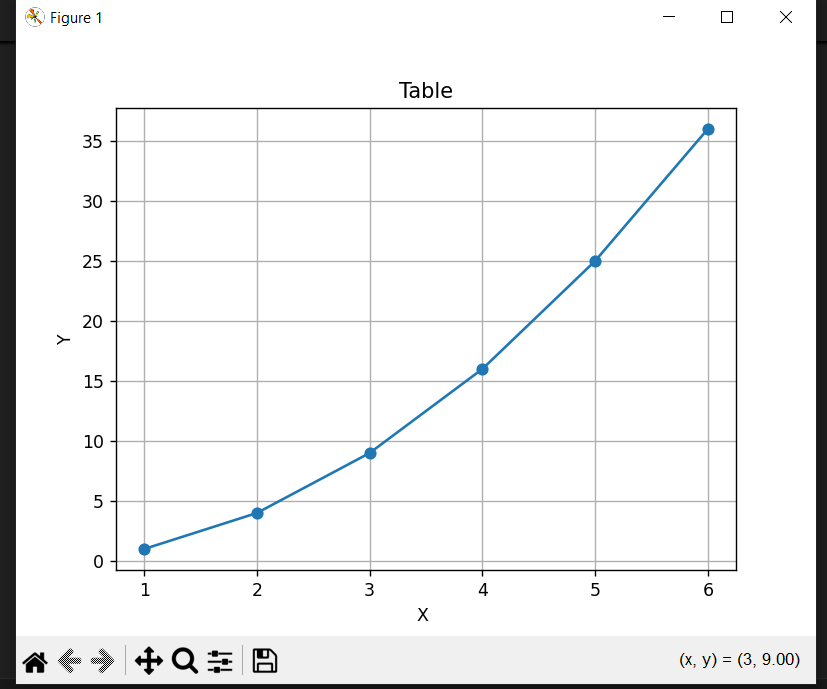

<h1>First simple project</h1>
<h5>This is a project for displaying and analyzing simple graphs.  I used the matplotlib library in it, which does the job well.
I plan to improve the project a bit.  Add a graphical interface and more useful features to it.</h5>
<h2>Examples:</h2>

